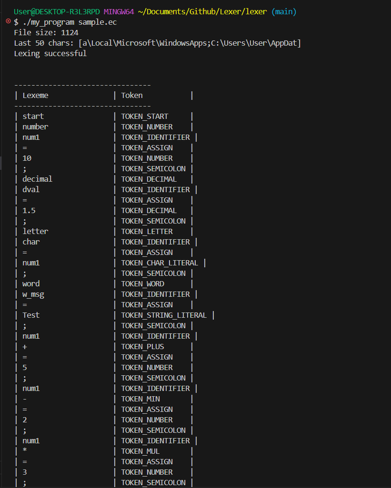

# Lexer
# My Program

A simple C-based lexer/parser program for `.ec` files.

## Prerequisites

- GCC (GNU Compiler Collection)
- Make sure `gcc` is installed and available in your PATH

## Project Structure

```
project/
├── include/          # Header files
├── src/
│   ├── main.c       # Main program file
│   └── lexer.c      # Lexer implementation
├── sample.ec        # Sample input file
└── README.md        # This file
```

## Installation & Usage

### 1. Clone the Repository

```bash
git clone <repository-url>
cd <repository-name>
```

### 2. Compile the Program

```bash
gcc -Iinclude src/main.c src/lexer.c -o my_program.exe
```

**Compilation flags explained:**
- `-Iinclude` - Adds the `include/` directory to the header search path
- `-o my_program.exe` - Specifies the output executable name

### 3. Run the Program

```bash
./my_program sample.ec
```

Or on Windows:
```bash
my_program.exe sample.ec
```

